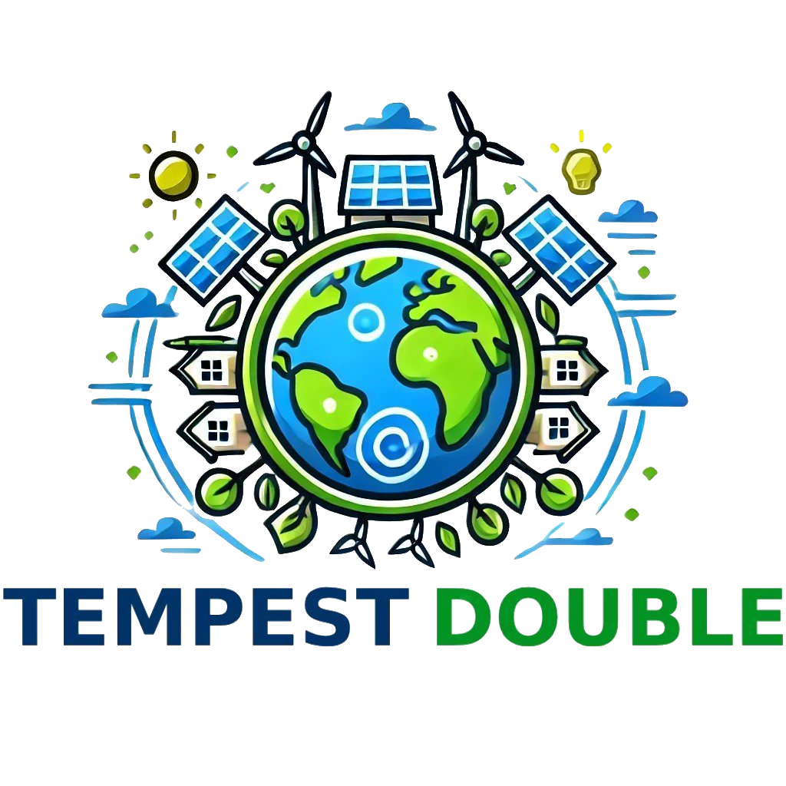

<div align="center">
    
</div>

Project dedicated to simulating and optimizing IoT and energy systems.

# Navigation
1. <a href="#objectives">Objectives</a>
2. <a href="#structure">Structure</a>
3. <a href="#how-to-use">How to Use</a>
4. <a href="#features">Features</a>
5. <a href="#technologies-used">Technologies Used</a>
6. <a href="#why">Why?</a>

# Objectives

The **Tempest Double** platform provides advanced tools for simulating IoT devices and virtual environments. Its main goals are:
- Efficient simulation of IoT assets categorized as **producers** (e.g., solar panels) or **consumers** (e.g., home appliances).
- Creation and analysis of complex topologies connecting multiple assets.
- Personalized configurations for specific scenarios to support various industries like smart grids, industrial automation, and smart homes.

# Structure

The project structure is designed as follows:
1. **Web Application**: Implements a Three-Tier architecture (GUI, Business Logic, Database).
2. **Subsystems**:
   - **Simulation API**: Handles simulation processes.
   - **Asset Management**: Manages IoT devices.
   - **Scenario Management**: CRUD operations for scenarios.
   - **Simulation History**: Stores and visualizes past simulations.
   - **Persistence**: Ensures data consistency using MySQL.

# How to Use

To run the application:
1. **Java**: Ensure JDK 11+ is installed.
2. **MySQL**:
   - Create the database using: `CREATE DATABASE tempest_double;`.
   - Update `application.properties` with:
     ```properties
     spring.datasource.url=jdbc:mysql://localhost:3306/tempest_double
     spring.datasource.username=root
     spring.datasource.password=
     ```
3. **Start the Application**:
   - Default server port: 8080.
   - Ensure port 8080 is free or change it in `application.properties`.

# Features

1. **User-Friendly Interface**: Create, view, and modify assets and scenarios.
2. **Real-Time Simulations**: Analyze energy consumption and production.
3. **History Tracking**: View results of past simulations for optimization.
4. **Customizable Topologies**: Drag-and-drop interface for asset connections.

# Technologies Used

- **Backend**: Java (Spring Boot, JPA, Hibernate)
- **Frontend**: HTML5, CSS3, JavaScript, Thymeleaf
- **Database**: MySQL
- **Build Tool**: Maven

---

Feel free to suggest changes or request enhancements!
